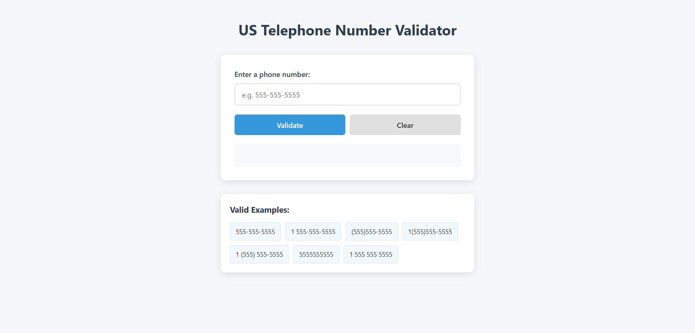

# Telephone-Number-Validator

This is a Free Code Camp survey project for practicing JavaScript in the **Javascript, Algorithms & Data Structure Curriculum.**



## Get Started

```bash
#First you need to clone this project
git clone https://github.com/Codeur-Omniscient/Telephone-Number-Validator.git

#Change directory
cd Telephone-Number-Validator
```

## Stack

- HTML
- CSS
- JAVASCRIPT
